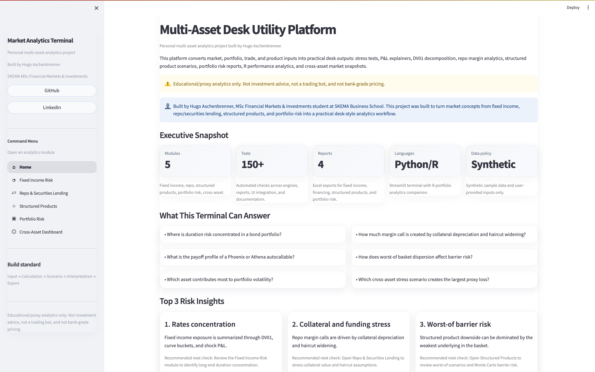
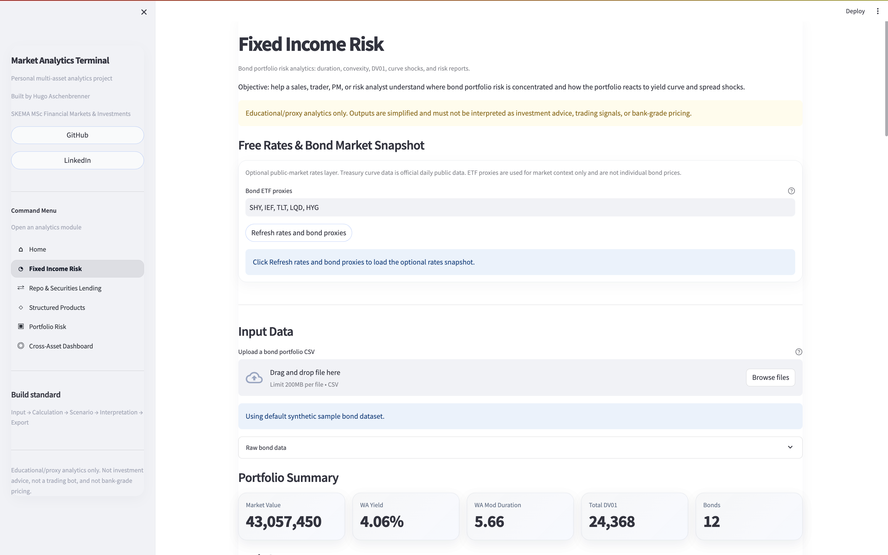
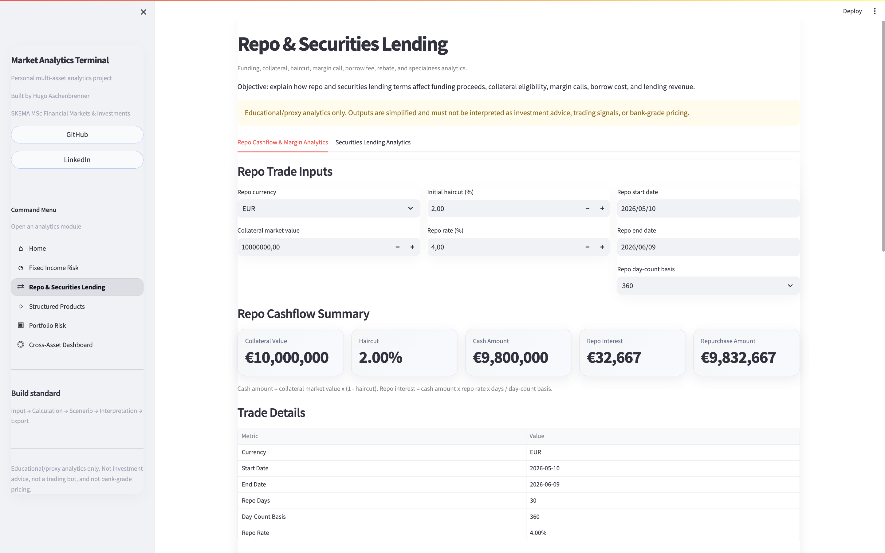
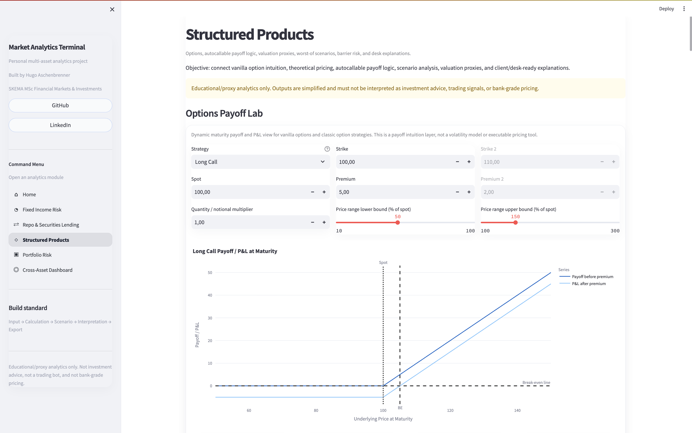
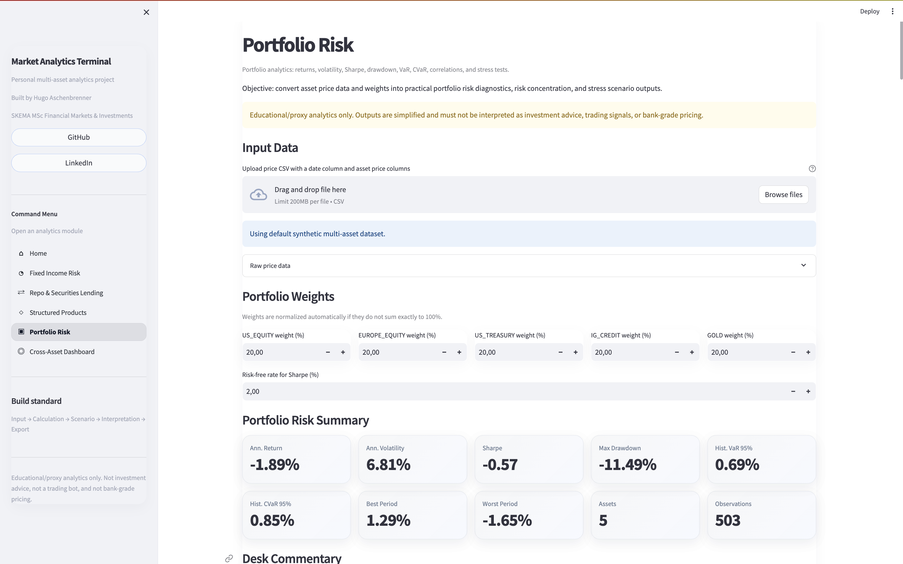
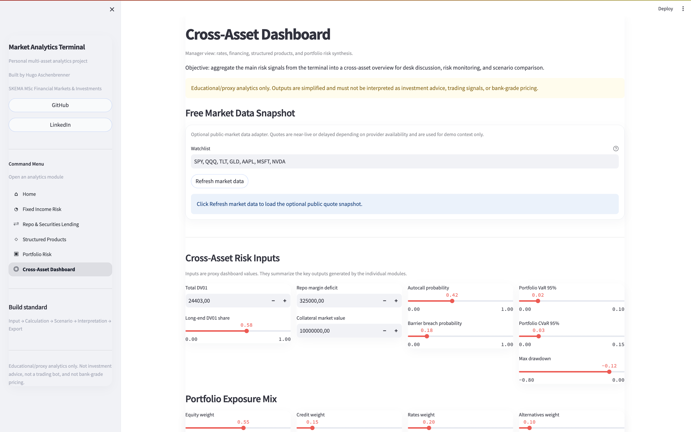

# Market Analytics Terminal

## Live Demo

[Open the Market Analytics Terminal](https://market-analytics-terminal.streamlit.app/)

A Python/R multi-asset analytics project built by Hugo Aschenbrenner, covering fixed income risk, repo and securities lending, structured products, portfolio risk, and cross-asset stress dashboards.

A multi-asset desk utility platform built with Python, Streamlit, and R.

The objective is not to build a generic student calculator. The objective is to build a practical analytics terminal that converts market, portfolio, trade, and product inputs into outputs a sales, trader, structurer, portfolio manager, or risk analyst can actually discuss:

- risk summaries
- scenario analysis
- stress tests
- payoff explainers
- margin analytics
- portfolio diagnostics
- Excel reports
- R-generated performance analytics

This project uses simplified, proxy-based analytics for demonstration. Outputs should not be treated as investment advice, executable quotes, issuer pricing, or production risk measures.

---

---

## Demo Screenshots

### Home — Multi-Asset Desk Utility Platform

### Fixed Income Risk — Duration, DV01, Curve Shocks and Rates Snapshot

### Repo & Securities Lending — Financing, Haircuts and Margin Stress

### Structured Products — Options Payoff, Black-Scholes Greeks and Autocallable Valuation Proxy

### Portfolio Risk — VaR, CVaR, Drawdown and Risk Contribution

### Cross-Asset Dashboard — Rates, Financing, Structured Products and Portfolio Risk Synthesis

---

## How to Demo the Project in 90 Seconds

1. Start on the Home page to show the project scope and ownership layer.
2. Open Fixed Income Risk to show DV01, duration/convexity and curve-shock interpretation.
3. Open Repo & Securities Lending to show collateral, haircut and margin-call mechanics.
4. Open Structured Products to show the full chain: options payoff, Black-Scholes pricing/Greeks, autocallable valuation proxy and payoff simulation.
5. Open Portfolio Risk to show VaR, CVaR, drawdown and risk contribution.
6. Finish on Cross-Asset Dashboard to show how the modules connect into a manager-style risk synthesis.

The intended message is simple: the terminal does not claim to replace bank systems; it demonstrates market logic, scenario thinking, risk decomposition, reporting discipline and desk-style interpretation.

## Core Modules

### 1. Fixed Income Risk

Bond portfolio analytics:

- clean / dirty price handling
- accrued interest proxy
- modified duration
- convexity
- DV01
- bucket risk decomposition
- curve shock scenarios
- simple hedge approximation
- Excel risk report

### 2. Repo & Securities Lending

Financing and collateral analytics:

- repo cash amount
- repo interest
- repurchase amount
- haircut sensitivity
- collateral shock
- margin deficit / surplus
- margin call logic
- securities lending borrow fee
- rebate amount
- collateralization rate
- specialness indicator
- financing and margin Excel report

### 3. Structured Products and Options

Autocallable and options analytics:

- Options Payoff Lab for vanilla options and classic option strategies
- Black-Scholes-Merton theoretical option pricer
- Greeks: delta, gamma, vega, theta, and rho
- Athena and Phoenix deterministic payoff logic
- memory coupon and coupon barrier logic
- autocall condition and protection barrier logic
- worst-of basket analytics
- path simulation payoff proxy
- autocall probability and barrier breach probability
- autocallable Monte Carlo valuation proxy
- expected discounted payoff and PV as percentage of notional
- volatility / correlation sensitivity
- structured products Excel report

### 4. Portfolio Risk

Portfolio and risk analytics:

- asset weights
- portfolio returns
- annualized return
- annualized volatility
- Sharpe ratio
- max drawdown
- historical VaR / CVaR
- correlation matrix
- covariance-based risk contribution
- predefined stress scenarios
- portfolio risk Excel report

### 5. R Portfolio Analytics Companion

R companion layer for buy-side style analytics:

- performance summary
- rolling volatility
- rolling Sharpe
- drawdown series
- monthly returns
- correlation matrix
- R-generated charts
- outputs displayed inside Streamlit

---

## Tech Stack

Python:

- Streamlit
- pandas
- numpy
- scipy
- plotly
- openpyxl
- xlsxwriter
- pytest

R:

- Base R implementation
- CSV output generation
- PNG chart generation
- portfolio analytics companion workflow

---

## Project Structure

market-analytics-terminal/
│
├── app.py
├── app_pages/
│   ├── home.py
│   ├── fixed_income.py
│   ├── repo_sec_lending.py
│   ├── structured_products.py
│   ├── portfolio_risk.py
│   └── cross_asset_dashboard.py
│
├── engines/
│   ├── fixed_income_engine.py
│   ├── repo_engine.py
│   ├── sec_lending_engine.py
│   ├── market_data_engine.py
│   ├── rates_market_data_engine.py
│   ├── options_payoff_engine.py
│   ├── options_pricing_engine.py
│   ├── structured_products_valuation_engine.py
│   ├── cross_asset_dashboard_engine.py
│   ├── structured_products_engine.py
│   ├── portfolio_risk_engine.py
│   └── scenario_engine.py
│
├── reports/
│   └── excel_exporter.py
│
├── r_analytics/
│   ├── portfolio_performance_report.R
│   ├── README.md
│   └── outputs/
│
├── data/
│   ├── sample_bonds.csv
│   └── portfolio_returns_sample.csv
│
├── docs/
│   ├── project_overview.md
│   ├── technical_validation.md
│   └── cv_positioning.md
│
└── tests/

---

## How to Run

Create and activate a virtual environment:

python3 -m venv .venv
source .venv/bin/activate

Install requirements:

python -m pip install -r requirements.txt

Run the app:

python -m streamlit run app.py

Run the R analytics companion:

Rscript r_analytics/portfolio_performance_report.R

Run the full test suite:

python -m pytest -q

---

## Current Test Coverage

The project contains more than 240 passing tests covering:

- fixed income analytics
- repo and securities lending
- Excel report generation
- structured product payoff logic
- worst-of basket analytics
- Monte Carlo simulation outputs
- portfolio risk analytics
- R analytics structure
- Streamlit integration checks

---

## Why This Project Matters

A basic pricer shows that someone can code a formula.

This project is different because it focuses on desk workflow:

1. Inputs are converted into interpretable risk outputs.
2. Outputs are linked to sales/trading/risk use cases.
3. Scenario analysis is prioritized over static valuation.
4. Excel reports are generated because desks still use Excel heavily.
5. R is used where it is credible: portfolio analytics and reporting.
6. Each module is tested, modular, and documented.

---

## Important Limitations

This project is not:

- bank-grade pricing
- live market data infrastructure
- a trading bot
- investment advice
- a production risk system
- a replacement for Bloomberg, Murex, Sophis, or internal desk tools

It is a transparent educational and portfolio project designed to demonstrate market understanding, technical execution, and practical desk workflow thinking.
