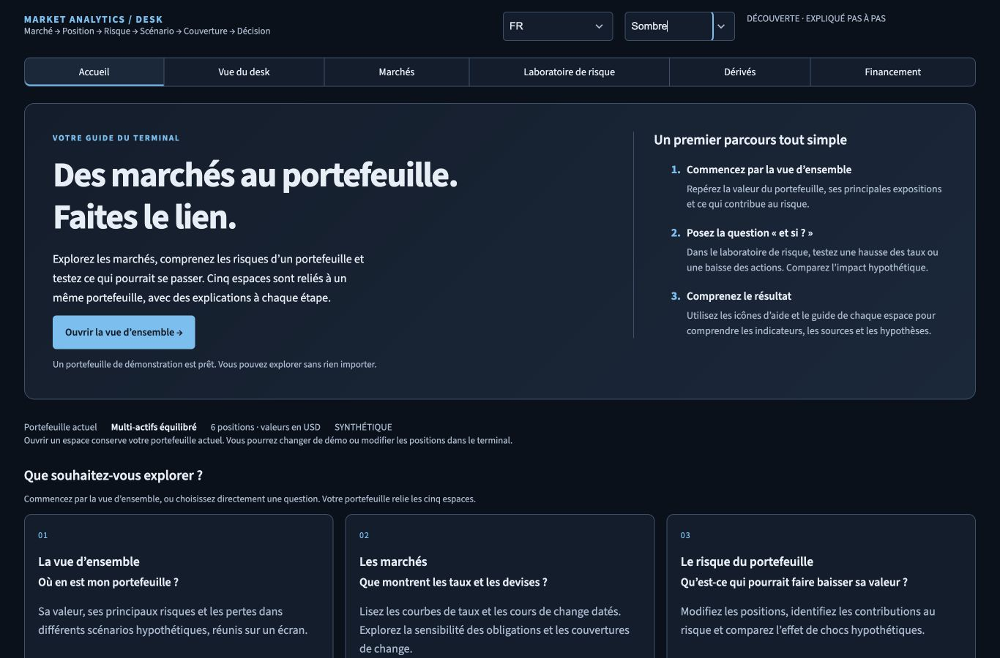
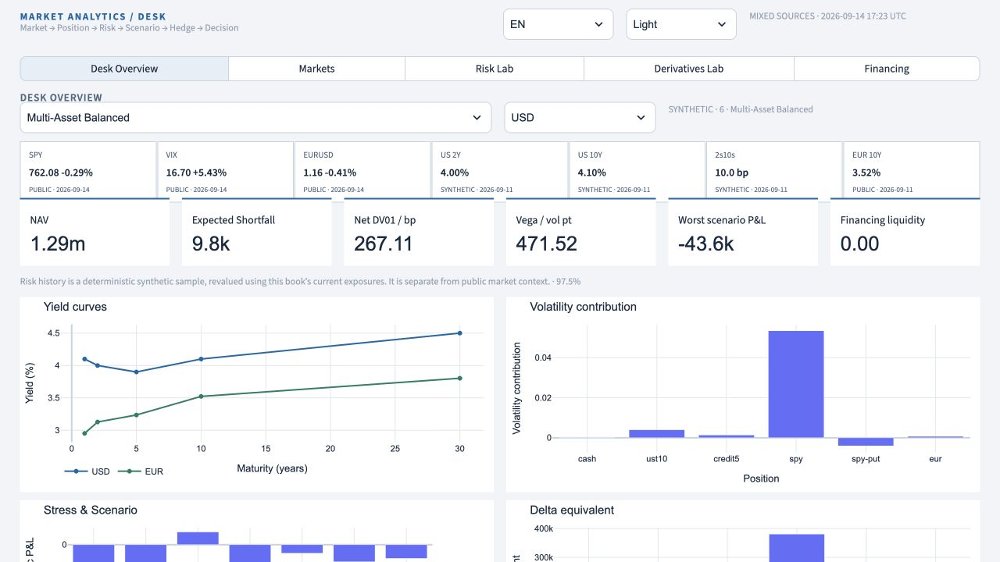
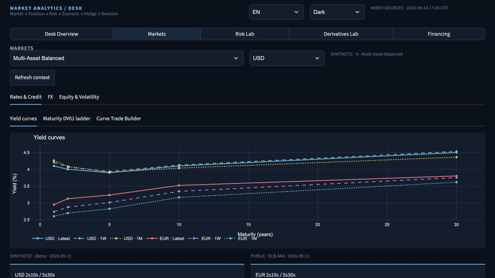
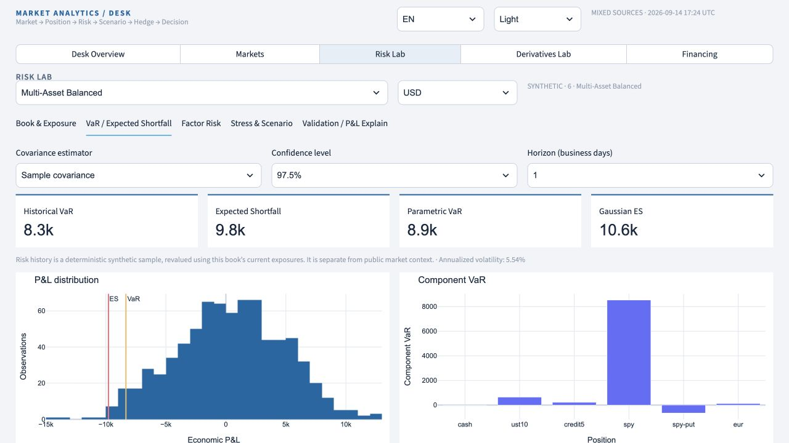
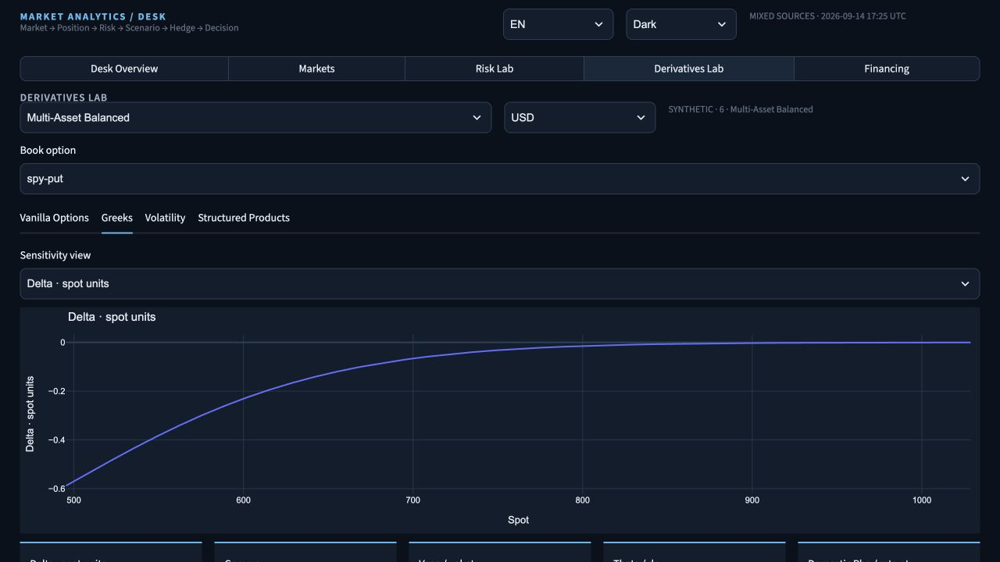
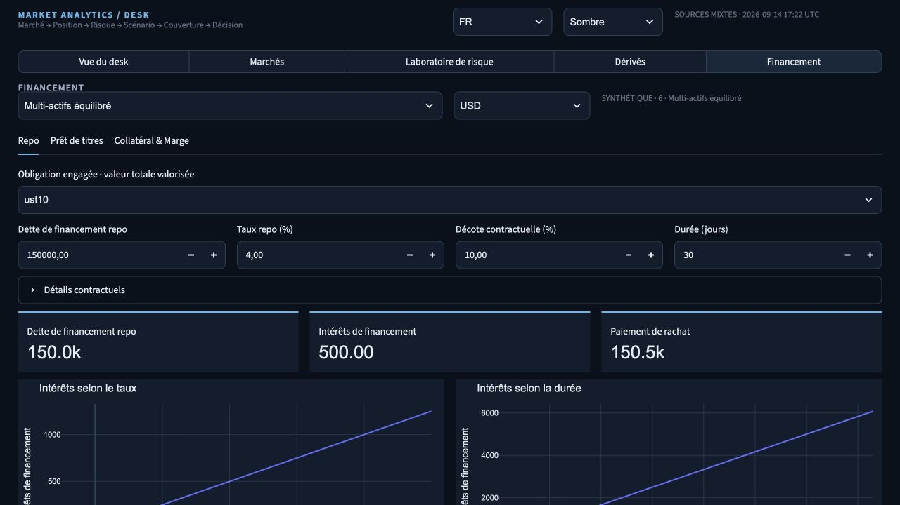

# Market Analytics Terminal

A Python/R Sales & Trading and cross-asset risk workstation by Hugo Aschenbrenner. One shared book connects **Market → Position → Risk → Scenario → Hedge → Decision** across five workspaces, with English/French and light/dark controls throughout.

This branch contains V2. The [hosted terminal](https://market-analytics-terminal.streamlit.app/) is a separate deployment and may still show the earlier version until this branch is merged and deployed. Screenshots below show the local V2 build.

The terminal opens on **Start / Accueil**, an introduction with a suggested first visit, a menu of the five workspaces and explanations of data, controls and simulations. A usable demo portfolio is ready. Public market context carries observation dates and source labels; portfolio risk history and volatility surfaces are explicitly synthetic. These are educational analytics, not executable quotes, issuer valuations or regulatory risk measures.

Select **Open the overview / Ouvrir la vue d’ensemble** to begin, or choose a workspace card. Returning to Start preserves the current portfolio. The introductory page loads without fetching market data; public context is requested when you first enter an analytical workspace. Use `?page=welcome&lang=fr&theme=dark` for the French introduction, or keep an existing workspace link for direct access. See the [welcome-page validation record](docs/welcome_2026_09_17.md).

## A 90-second demonstration

1. **Desk Overview:** identify the loaded book, NAV, Expected Shortfall, DV01, Vega, worst scenario and financing liquidity. Read the numerical risk insights below the chart grid.
2. **Markets:** inspect dated US/euro curves and book sensitivities; express a view with a DV01-neutral curve trade, or compare forward, option and collar hedges for a corporate FX exposure.
3. **Risk Lab:** edit the shared book, select a covariance estimator, inspect Component VaR and apply a cross-asset stress. Economic losses and liquidity needs remain separate.
4. **Derivatives Lab:** explain option P&L with Greeks and full repricing, simulate delta hedging, or inspect Athena/Phoenix worst-of valuation and Monte Carlo risk. Open **Product workshop / Atelier produits** for option strategies, eight barrier variants and Discount/Bonus certificates with component valuation and explanations.
5. **Financing:** inspect contractual repo margin, securities-lending economics and refinancing capacity. Prepare a unified or focused Excel report from any workspace.

Select Multi-Asset Balanced, Rates & FX Macro, Equity Options Book or Structured Products / Hedged Book. CSV import is optional under **Load custom book**; the editable book supports 100 positions. Language, theme and book selections persist within the session. Links can specify `?page=overview&lang=en&theme=dark`.

## Workspaces and analytics

- **Desk Overview:** shared marked NAV and risk KPIs, yield curves, risk contributions, scenario P&L and calculated concentration/Greek insights.
- **Markets — Fixed Income Risk and FX:** audited clean/dirty bond valuation, ACT/ACT schedules, duration/convexity, DV01/CS01, key-rate ladders, carry/roll estimates, curve overlays and trade builders. FX includes covered interest parity, cross-rates, swap points, Garman–Kohlhagen Greeks and client hedge comparisons.
- **Risk Lab — Portfolio Risk:** sample, EWMA and Ledoit–Wolf covariance; historical/Gaussian VaR and ES; marginal/component/incremental risk; rolling diagnostics, drawdown and exceedances; curve PCA; coherent equity/FX/rates/credit/volatility/correlation stresses.
- **Derivatives Lab — Structured Products and options:** BSM, bounded implied-volatility inversion, analytical Vanna/Volga/Charm, curves/heatmaps, synthetic volatility surfaces, P&L attribution and self-financing hedging simulation. Athena/Phoenix contracts share controlled Monte Carlo valuation, probabilities and bump risk with the rest of the book. The independent Product workshop adds eleven expiry strategies with model/manual premiums and aggregate Greeks, continuous zero-rebate barrier options, and Discount/Bonus/Capped Bonus certificates with conditional redemption charts.
- **Financing — Repo & Securities Lending:** contractual cash flows and margin with threshold/MTA/rounding, cash/non-cash lending economics, collateral shocks and haircut-dependent refinancing capacity.
- **R Portfolio Analytics Companion:** reproducible CSV/PNG reporting and Python/R parity checks, available as a technical expander in Risk Lab. Its bundled dataset is separate from the current book.

Charts and headline metrics lead each workflow. Detailed data, formulas, assumptions and reports are collapsible. The four original Excel exporter APIs and audited financial engines remain available alongside the unified V2 report.

## Reading the terminal on any screen

The header, controls, KPI cards and chart columns adapt to phone, tablet and large desktop widths. On a phone, scroll the market strip and long tab lists sideways; detailed tables scroll inside their own panels. Light and dark charts share consistent, contrast-checked colors.

Open **Understand this workspace · data & controls** in any analytical workspace for a plain-language introduction, an inventory of actual data sources and observation dates, explanations of why values change or stay fixed, and a metric glossary. The help icon beside each KPI explains its units and reveals a more precise value. The same guidance is available in French; Start provides a shorter introductory FAQ.

Public context refreshes on request through a 15-minute cache; there is no streaming feed. The guide distinguishes shared book edits from local what-if controls, public observations from synthetic samples, and market curves from model-rate assumptions. See the [responsive UI validation and current screenshots](docs/ui_responsiveness_2026_09_15.md).

The Product workshop is a separate experiment inside Derivatives Lab: its user-entered examples do not modify the shared book or exported desk report. Explanations distinguish theoretical price from cash redemption and P&L, and model touch probability from a market forecast. See the [product research, conventions and validation record](docs/derivatives_workshop_2026_09_17.md), including the 652-test regression result and mobile/desktop captures.

## Demo Screenshots

Local V2 captures; displayed public observations are dated snapshots, not current quotations.

### Start / Accueil — French, dark



### Desk Overview — light



### Markets — dark



### Risk Lab — light



### Derivatives Lab — dark



### Financing — French, dark



## Run locally

Python 3.11+ is recommended; this revision was validated with Python 3.12 and Streamlit 1.63.0. R is optional for the terminal itself and required to regenerate companion outputs and execute R parity checks.

```sh
python3 -m venv .venv
source .venv/bin/activate
python -m pip install -r requirements.txt
python -m streamlit run app.py
```

No API key is required. On entry to an analytical workspace, the market service automatically requests public context, caches it for 15 minutes and falls back to dated cached or labelled synthetic series when a provider is unavailable. An offline session remains usable.

```sh
python -m pytest -q
python -m compileall -q app.py core components app_pages services engines reports
Rscript r_analytics/portfolio_performance_report.R
```

UI tests use deterministic offline market fixtures. Public adapter tests cover parsing, dates and failures; a passing suite does not promise continuing provider availability.

## Architecture

```text
app.py                 session initialization and workspace routing
core/                  typed state, book validation, i18n, semantic themes
components/            shared controls, charts, formulas and nested workflows
app_pages/             welcome plus overview, markets, risk_lab, derivatives_lab, financing
services/              market adapters, shared marks, risk and financing
engines/               audited pricing, payoff, risk and scenario calculations
reports/               unified V2 report and preserved Excel exporters
r_analytics/           standalone report, CSV/PNG outputs
tests/                financial, state, UI, report and R regression coverage
```

See [project architecture](docs/project_overview.md), [financial conventions and validation](docs/technical_validation.md), [V2 requirement completion](docs/v2_completion.md), [checkpoint history](docs/v2_progress.md), [test migration ledger](docs/v2_test_migration.md) and the [original audit](docs/audit_2026_09_10.md). Interview wording is in [CV positioning](docs/cv_positioning.md).

## Data and model boundaries

Yahoo daily bars may contain an unfinished session. FRED Treasury and ECB euro-area curves have different construction and publication calendars; the latest retrieval time is not an observation date. PUBLIC, SYNTHETIC and USER INPUT provenance remains visible, with MODEL identifying calculated marks.

V2 portfolio return/risk history is a deterministic 756-observation scenario sample applied to current exposures, **not historical performance or a backtest of a traded strategy**. Its ES view at 97.5% is educational/FRTB-inspired, without regulatory compliance. Bond schedules in the simplified editor assume semiannual coupons and inferred dates; the underlying audited engine supports fuller contractual inputs. Equity book options use European BSM with zero dividend yield; FX options are priced in the dedicated GK workspace rather than accepted as equity options in the book.

Synthetic volatility surfaces are not calibrated or guaranteed arbitrage-free. Monte Carlo structured prices and sensitivities have sampling error and omit issuer credit, funding, transaction costs and model calibration. Curve trades, carry/roll and hedges are analytical approximations. The [validation document](docs/technical_validation.md) specifies units, signs, assumptions and tests so these limits remain reviewable.
