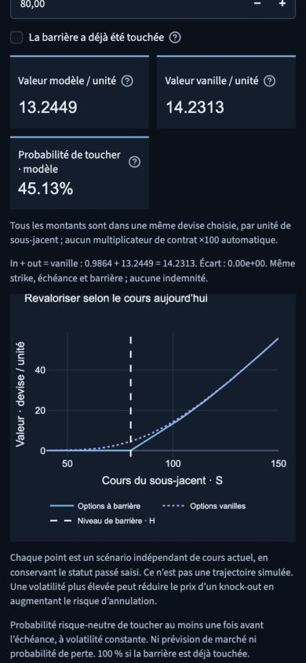
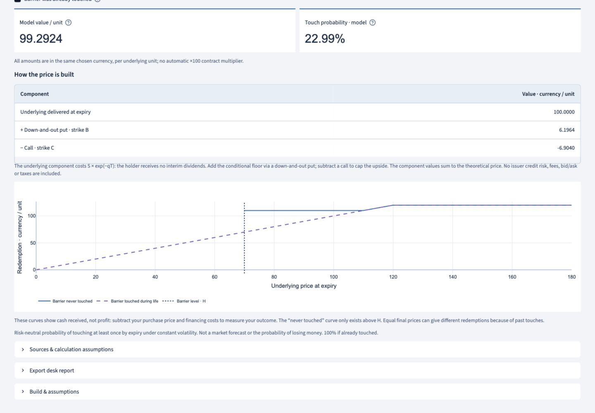

# Derivatives product workshop — 17 September 2026

## Request and recovered state

The request was to explore Derivatives Insights and use useful product/function ideas to enrich the existing terminal. The V2 welcome page, responsive theme, educational guides and previous financial audit were already committed at `b81611a`; that work was preserved.

At the first interruption, `4c99d84c081451eaf37690d2472a3e8e8afb0c75` already contained the new barrier/certificate engine and its 83 tests. The full suite then passed 586 tests, and this SHA was verified on `origin/codex/terminal-v2`. The workshop UI, bilingual text and strategy adapter existed as uncommitted work. Resumption completed those files, added integration/regression tests, and checkpointed the tested interface at `077c446`.

At the final resumption, `077c446248f7341e251aa5966170e5df2d023f9d` was confirmed both locally and on GitHub. All implementation was already committed, with 652 tests passing and the browser checks completed. Only this documentation, the README update and two verified screenshots remained uncommitted. The final pass preserved that implementation, reran validation and published those remaining artifacts.

## Exploration and selection

The public [Derivatives Insights catalog](https://derivativesinsights.com/) emphasizes interactive pricing, payoff decomposition and explanations next to results. Public pages reviewed included [strategies](https://derivativesinsights.com/options-strategy), [barriers](https://derivativesinsights.com/barriers), [structured certificates](https://derivativesinsights.com/structured), [volatility models](https://derivativesinsights.com/vol-models), [fixed income](https://derivativesinsights.com/fixed-income), [variance/volatility swaps](https://derivativesinsights.com/vol-swaps) and [Monte Carlo](https://derivativesinsights.com/monte-carlo).

V2 already has vanilla pricing, advanced Greeks, volatility experiments, delta hedging, bond analytics and Athena/Phoenix notes. The selected additions complement these existing tools:

- Eleven single-expiry option strategies using the terminal's audited payoff engine, with either model or entered premiums.
- All eight European single-barrier variants: call/put, up/down, knock-in/knock-out.
- Discount, Bonus and Capped Bonus certificates with an explicit component valuation and conditional redemption chart.

This is an original implementation, not a copy of the site's code, wording or paid interview materials. It is not an integration or data feed. Heston/SABR calibration, XVA, callable/convertible bonds, swaps and Turbo certificates are outside this selected increment; the terminal does not claim to implement the whole source catalog.

## Where to find it

Open **Derivatives Lab → Product workshop** or **Dérivés → Atelier produits**. The welcome card and workspace guide introduce the additions. The experiments work with any demo book, including one with no options.

All workshop inputs are independent examples/user entries, initially normalized to spot 100. Editing them does not book a trade, alter shared risk, or change the exported desk report. Values persist within the session when changing tools, languages, themes and workspaces. There is no persistence after starting a new browser session.

## Financial conventions

### Strategies

The existing `options_payoff_engine.py` still supplies signed legs, exact piecewise-linear break-even calculations, maturity P&L and full-domain risk limits. The new adapter supplies consistent Black–Scholes premiums and aggregates Delta, Gamma and Vega with signed economic units, including underlying legs.

All legs have one expiry. Dividend yield is zero. Premiums and strikes are per underlying unit; displayed strategy cost, P&L and Greeks include the selected units. There is no implicit contract multiplier of 100. An entered premium is non-negative; the engine applies the buy/sell sign. The net initial outlay includes any stock purchase. Positive outlay means cash paid, negative outlay means cash received.

Maturity P&L subtracts the undiscounted entry cost. Financing, margin, fees, early exercise and dividends are excluded. With non-zero rates, positive nominal P&L at every final price does **not** establish arbitrage; a visible explanation distinguishes cash at entry from cash at expiry. Model Greeks remain model sensitivities even when premiums are entered manually. Vega is per one percentage point of annual volatility.

Break-even prices and unlimited losses are independent of chart limits. Flat zero-P&L regions are explicitly identified, including the zero-premium option cases. Strategy descriptions follow the conventional definitions documented by the [Options Industry Council](https://www.optionseducation.org/strategies/all-strategies-en).

### Barriers

`barrier_certificate_engine.py` uses an absorbing lognormal transition density under constant-volatility Black–Scholes–Merton. Rates and dividend yields are continuously compounded. Exercise occurs only at expiry, monitoring is continuous, and rebate is zero. This model convention is also represented by the [QuantLib analytic barrier engine](https://github.com/lballabio/QuantLib/blob/master/ql/pricingengines/barrier/analyticbarrierengine.cpp); our engine integrates normal moments rather than porting its case table.

For direction sign d = +1 (down) or −1 (up), let x = d log(S/H), b = d(r−q−σ²/2), and v = σ²T. Before a touch, the surviving log-distance density on y > 0 is:

```
normal_density(y; x+bT, v)
  − exp(−2bx/σ²) × normal_density(y; −x+bT, v).
```

Integrating the option payoff against this density and discounting gives the knock-out. The knock-in is the vanilla price minus the knock-out. Integrating the density without the payoff gives survival probability. Normal-tail differences are evaluated in log space. The engine also handles expiry and the deterministic zero-volatility limit.

A touch at equality counts. Past touches are irreversible and can be entered explicitly; the terminal does not retrieve historical barrier observations. Repricing curves preserve a touch already implied by the current spot. Each point is an independent current-spot scenario, not a path. The touch probability is risk-neutral, not a forecast or a probability of losing money.

### Certificates

The stylized claims pay no interim dividends. Let B be the Bonus level and C the cap:

```
Prepaid underlying = S exp(−qT)
Discount          = prepaid underlying − call(C)
Bonus             = prepaid underlying + down-and-out put(B, H)
Capped Bonus      = Bonus − call(C), with C ≥ B > H
```

Discount redemption is min(S_T, C). Bonus redemption is max(S_T, B) only if the lower barrier was never touched; after a touch it is S_T. Capped Bonus applies C to either outcome. The chart omits the impossible never-touched branch at S_T ≤ H. Once a historical touch is entered, it removes that branch entirely.

The chart shows redemption, not investment profit. The purchase price and financing still have to be deducted. There is no unconditional capital guarantee. In particular, when q=0, an uncapped Bonus adds a non-negative put value to spot: a valuable conditional floor is not free. This is why website examples are not treated as calibrated quotes or copied as pricing benchmarks.

Issuer credit, funding spreads, fees, taxes, transaction costs, discrete monitoring and smile calibration are not modeled. These assumptions are visible next to the relevant controls and charts.

## Validation

- Full regression suite: **652 passed**, including existing R parity checks; no failures or skips.
- Barrier/certificate coverage: 83 tests, including independent numerical integration of terminal-normal payoffs weighted by Brownian-bridge survival, for calls/puts, both directions, strikes above/at/below barriers, dividends, negative rates and different maturities/volatilities. Also in/out parity, equality touch, prior touch, expiry, deterministic paths, extreme normal tails, component replication and invalid terms.
- Strategy/workshop coverage: 66 tests covering all eleven presets, quantity scaling, finite-difference Delta/Gamma/Vega, manual premiums, zero-P&L intervals, unlimited losses, all eight barrier UI variants, certificate variants in both languages/themes, invalid inputs, negative-rate premiums above strike, preservation of book state, and restoration after inactive-widget cleanup.
- Compilation: `python -m compileall -q app.py core components app_pages services engines reports` passed.
- Whitespace/diff check: `git diff --check` passed.
- Real-browser checks at 1440×1000, 390×844 and 320×800: no page-width overflow; plot legends remain readable; inputs stack and KPI cards wrap. English/French and light/dark transitions preserve the selected workshop. Small replication tables use semantic HTML with theme colors instead of a dark native canvas in light mode.
- Live UI check: default down-and-out call 13.2449, vanilla 14.2313, touch probability 45.13%; entering a prior touch changes the knock-out to zero and touch probability to 100%.

Captured local build examples:





The GitHub branch is `codex/terminal-v2`. Pushing this branch does not merge it into `main` or change the separate Streamlit Cloud deployment. The public URL may continue to show the earlier build until deployment is explicitly updated.
