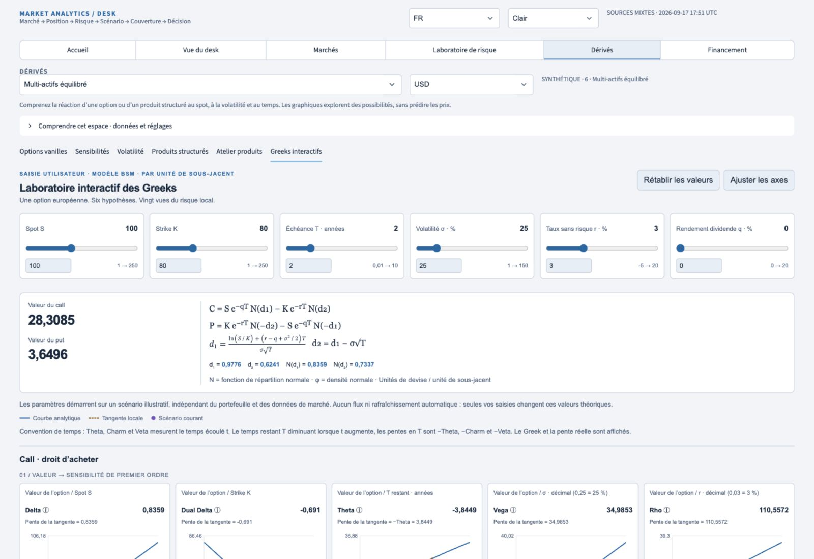
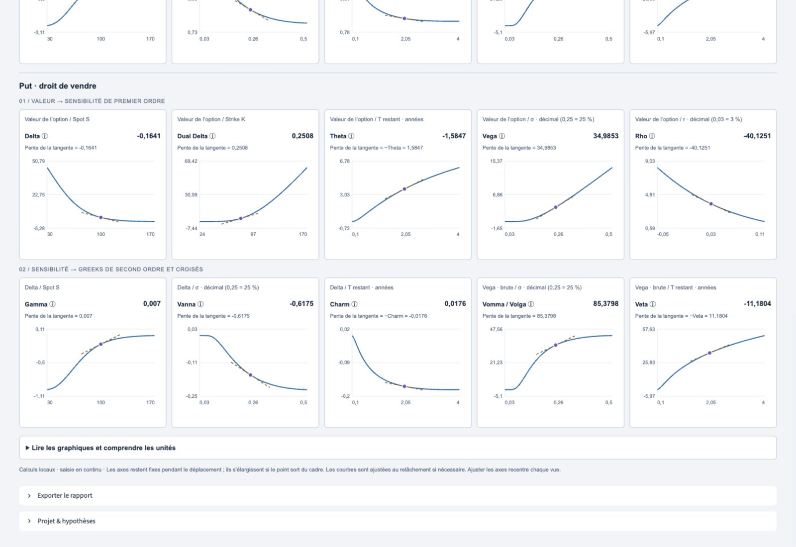
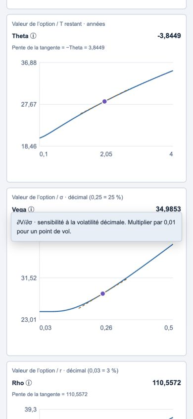

# Interactive Greeks Lab

Delivered 17 September 2026 on `codex/terminal-v2`.

## Where to find it

Open **Derivatives Lab → Interactive Greeks Lab** (French: **Dérivés → Greeks interactifs**).
The existing Vanilla Options, Greeks, Volatility, Structured Products and Product workshop tabs remain available.
The lab starts at S=100, K=80, T=2 years, σ=25%, r=3%, q=0%.
Call value is 28.30846514 and put value is 3.64962783 (rounded on screen).

This is a standalone illustrative option, not the selected book contract. Neither live quotes nor book edits overwrite its six inputs. The broader terminal still loads public market context for its other workspaces. Lab scenarios are retained in this browser tab's session storage through language/theme changes and tab navigation, but are not included in the desk report. Reset restores all six defaults. If browser storage is disabled, live interaction still works; remounts then restore defaults.

## Architecture and live updates

The shell is a Streamlit 1.63 v2 custom component, isolated in a shadow root. It uses locally shipped ES modules and CSS, with the existing MAT theme tokens and bilingual copy. No CDN, JavaScript build step or deployment-time Node dependency is needed.

An HTML range slider emits **`input`** events while moving. Its handler updates local state and schedules at most one `requestAnimationFrame`. That frame calculates the model, all sampled curves, prices, Greek labels, current points and tangents, then updates the existing SVG nodes synchronously. There is no Python callback or Streamlit rerun in that loop. `change`/pointer release only handle final axis fitting; they are not responsible for the live pricing updates.

SVG was chosen over twenty Plotly instances to keep DOM updates small and synchronous, without a multi-megabyte chart bundle or independent asynchronous chart lifecycles. The other MAT Plotly charts are unchanged. This lab does not expose Plotly's zoom/export toolbar; use **Fit chart axes** to recenter the views. Price/Greek curves have 101 regular samples plus the current point, with up to 25 additional spot/strike samples around the rapid transition near expiry. The five sampled input grids are reused across both option sides and multiple charts, with at most 127 points per curve.

Axes remain fixed during ordinary drags. A range expands with margin only when the current point leaves the view. A temporarily clipped curve is identified explicitly; release fits it when necessary. Numeric edits refit the vertical scale, and Fit chart axes rebuilds all domains around the scenario. Curves are recalculated immediately throughout these operations.

The ordered matrix is repeated for call then put:

1. Value against S, K, remaining T, σ, r → Delta, Dual Delta, Theta, Vega, Rho.
2. Delta against S, σ, remaining T; raw Vega against σ, remaining T → Gamma, Vanna, Charm, Vomma/Volga, Veta.

Rows remain separate as the responsive layout changes from five to three, two and one column. Color and line style distinguish the analytical curve, dashed local tangent and current-state dot. Greek buttons offer mathematical definition, interpretation and units on hover, focus or tap. Invalid/unfinished numeric input keeps the last valid scenario, shows a translated message and is restored on blur.

## Source of truth and conventions

`engines/options_pricing_engine.py` is the canonical Python BSM implementation. Its new full-precision `black_scholes_raw_greeks` is used by both the legacy market-unit Greek API and `pnl_explain_engine.advanced_greeks`; the latter no longer repeats the cross-Greek formulas. Legacy return names and ten-decimal rounding are preserved. Normal CDF now uses `erfc` so small negative tails are not lost by subtracting from one.

The browser engine is a necessary JavaScript port for local execution, continuously tested against this canonical Python engine rather than an independent financial convention. Its normal CDF evaluates regularized incomplete gamma series/continued fractions and is checked against SciPy, including far tails. Mathematical references: [NIST DLMF series](https://dlmf.nist.gov/8.7) and [continued fractions](https://dlmf.nist.gov/8.9).

Inputs use remaining years T and decimal σ, r, q internally; the control bar displays σ, r and q as percentages. Spot, strike and option values are in arbitrary but consistent currency units per unit of underlying; no position multiplier is applied. Rates and dividend yields are continuously compounded. The formulas displayed in the lab are:

```
d1 = [ln(S/K) + (r − q + σ²/2)T] / (σ√T)
d2 = d1 − σ√T
C  = S exp(−qT) N(d1) − K exp(−rT) N(d2)
P  = K exp(−rT) N(−d2) − S exp(−qT) N(−d1)
```

All partial derivatives hold other inputs fixed. With D=exp(−qT), R=exp(−rT), and φ the normal density:

```
Delta_call = D N(d1); Delta_put = −D N(−d1)
Gamma = D φ(d1) / (S σ√T)
Vega = S D φ(d1) √T
DualDelta_call = −R N(d2); DualDelta_put = R N(−d2)
Rho_call = K T R N(d2); Rho_put = −K T R N(−d2)
Theta_call = −S D φ(d1) σ/(2√T) − r K R N(d2) + q S D N(d1)
Theta_put  = −S D φ(d1) σ/(2√T) + r K R N(−d2) − q S D N(−d1)
Vanna = −D φ(d1) d2/σ
Vomma = Vega d1 d2/σ
a = ∂d1/∂T = [2(r−q)T − d2 σ√T] / [2T σ√T]
Charm = q Delta − D φ(d1) a
Veta = Vega [q + d1 a − 1/(2T)]
```

**Theta, Charm and Veta differentiate elapsed time t: ∂/∂t = −∂/∂T.** Therefore a chart against remaining T has slope **−Theta**, **−Charm**, or **−Veta**. Both the named Greek and the actual tangent slope are displayed, so a positive remaining-time slope is never mislabeled as elapsed-time Theta. The same convention already applies in MAT's P&L Explain.

Volatility and rate chart axes use decimal coordinates, so tangent slopes are the raw derivatives shown. The help panel separately displays Vega × 0.01 per volatility point, Rho × 0.0001 per basis point and Theta/365 per calendar day. Python and JS adapters also support dividing annual Theta by 252 for a future trading-day display, without claiming to implement a business-day calendar model. Cash Greeks and the next P&L decomposition are intentionally outside this iteration; the raw, UI-independent engines can supply them later.

## Files

Created:

- `components/interactive_greeks.py`: runtime registration, asset composition and Streamlit shell.
- `components/greeks_lab/engine.mjs`: reusable BSM and convention adapters.
- `components/greeks_lab/curves.mjs`: exact matrix, domains, shared sampled curves and tangents.
- `components/greeks_lab/state.mjs`: defaults, control ranges and numeric validation.
- `components/greeks_lab/format.mjs`: terminology and cached locale formatting.
- `components/greeks_lab/render.mjs`: component lifecycle, live events, reused SVG rendering and local persistence.
- `components/greeks_lab/lab.css`: isolated responsive layout and theme styling.
- `core/greeks_lab_copy.py`: EN/FR control, explanatory and tooltip copy.
- `tests/test_interactive_greeks.py`, `tests/js/greeks_bridge.mjs`, `tests/js/greeks_client.test.mjs`: canonical/JS parity, mathematics, curves, input validation and app integration.
- This document and the accompanying lab screenshots.

Modified:

- `engines/options_pricing_engine.py`: centralized full-precision Greeks, stable CDF and convention adapter.
- `engines/pnl_explain_engine.py`: reuse canonical cross Greeks.
- `app_pages/derivatives_lab.py`: independent sixth tab and avoid unnecessary book valuation for independent tools.
- `core/i18n.py`: translated navigation label.
- `README.md`: feature location, architecture link and Node test prerequisite.

## Validation and reconstruction

Before the interruption, the audited V2/workshop work was already pushed through `abc8fb9`. The financial foundation for this lab was then validated with **689 passing tests** and pushed as `4f3790c`. The interface was implemented locally and its first real slider test produced eight redraws while the pointer was held down. The repository/remote inspection on resumption confirmed that exact state; no prior changes were discarded.

After resumption, fresh-runtime component registration, final axis fitting and responsive verification were completed. The interface checkpoint `a835124` was validated with **694 passing tests** and pushed. Final refinements cover tappable help and avoiding book valuation for this standalone lab. The final full suite passed **694 tests in 43.84 seconds**, without skips; Python compilation and `git diff --check` also passed. No browser console errors were recorded in the final local session.

Financial coverage includes put-call parity, the Delta identity, call/put Gamma/Vega equality, and central differences for all ten displayed Greeks, including Dual Delta, Charm and Veta. Cases include ATM/ITM/OTM, short/long maturity, low/high volatility, negative rates and positive dividends. Cross-runtime validation covers 300 seeded random scenarios, all 64 corners of the UI range, and nine targeted cases. CDF tails are compared with SciPy down to −38. Curve tests validate all twenty current points and tangent slopes and verify that every control changes its affected charts. Browser modules execute in Node during pytest; tests fail explicitly if Node is absent instead of silently skipping parity checks.

UI verification used the running Streamlit app: EN/FR, dark/light, widths 1600/1100/768/390 px, twenty graphs, 5/3/2/1 columns, no component horizontal overflow, synchronized numeric entry, reset, invalid T=0 rejection, and persistence through theme/language changes. At σ=20% → 39.8%, a real drag produced **eight frames while the pointer was held**, changing call price from 26.6872 to 34.0844 and updating Delta, Gamma, Vega, curves, points and tangents. The measured last update cost was **2.4 ms**, with **7.6 ms p95** across the small observed frame sample; this is JavaScript computation/DOM-update time, not a universal 60-FPS guarantee. Axes fitted clipped curves in the next frame after release.

Run validation with Python dependencies installed and Node.js 20+ on PATH:

```sh
python -m pytest -q
python -m compileall -q app.py core components app_pages services engines reports
git diff --check
```

If needed, set `NODE_BINARY=/absolute/path/to/node` for pytest. The application itself needs only its existing Python requirements.

Captures from the running application:







## Assumptions and scope

European exercise, constant volatility, continuous dividend yield/rates, no fees, discrete dividends, bid/ask, American features or stochastic-volatility calibration. Floating-point tails below representable precision may be zero. These are theoretical model values, not executable quotes. Inputs are per underlying unit, and native HTML numeric inputs follow the browser's locale behavior.

The [reference explorer](https://learnforeverlearn.com/blackscholes/) was inspected before implementation for the control/pricing/matrix organization and tangent interaction. No branding, copy, CSS, images or source assets were copied. MAT uses standard Dual Delta terminology and its existing elapsed-time convention instead of the reference's experimental labels/sign ambiguities.

Pushing this branch is not proof that the public Streamlit deployment follows it. Production deployment was not changed as part of this implementation.
