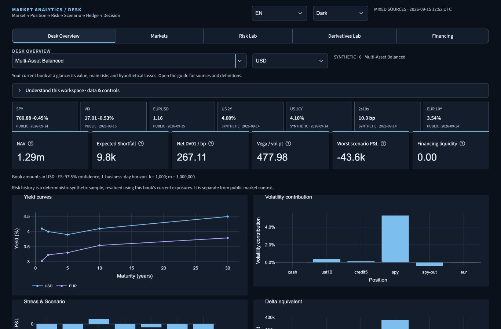
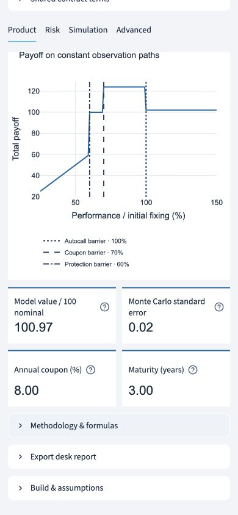
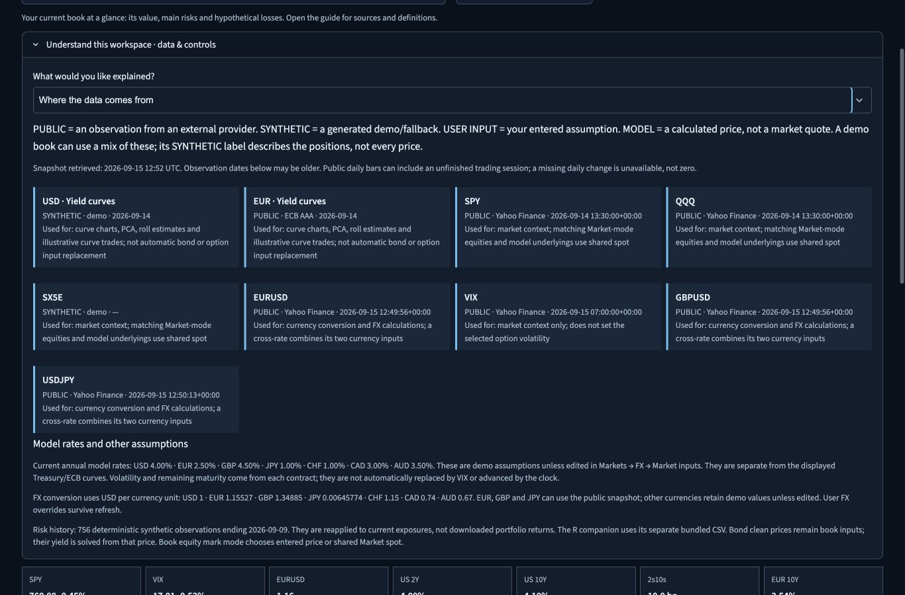

# Responsive UI and explanations — 15 September 2026

## Scope and recovered state

The original seven-phase V2 implementation was already completed and pushed at `e52fdc3`, with 472 passing tests. Its financial engines, audit corrections, reports, five workspaces and English/French support were preserved. This follow-up addresses responsive layouts, color consistency, overlapping labels and explanations of data and controls.

The interrupted UI work initially contained seven modified files and a passing 29-test focused run. Those changes were retained and completed. Subsequent resumes checked the working tree, staged changes, history, branch and actual remote before continuing. No existing changes were discarded or rebuilt from scratch.

Completed checkpoints on the existing `codex/terminal-v2` branch:

- `4d40e48`: responsive layout, chart styling and contrast-checked themes; 477 tests passed. Committed, pushed and remote-verified.
- `fddc7fa`: bilingual workspace guides, actual source inventory, metric help, numerical display precision and explanations of shared versus local controls; 491 tests passed. Committed, pushed and remote-verified.
- `708b7ea`: mobile structured-product barrier legends, visible help icons, fully opaque explanatory captions and themed tab-scroll controls. A 492-test full run and a subsequent 33-test focused run passed; compilation and whitespace checks passed. Committed, pushed and remote-verified.

## What changed

The header and book controls wrap at narrow widths. KPI cards use a responsive grid with two columns on phones. Charts and input groups stack below 640 pixels, while the main content remains bounded on wide screens. Market tiles and long tabs have contained horizontal scrolling. Formula panels can scroll without widening the page.

The shared Plotly theme resolves both ordinary palette colors and Streamlit's temporary color placeholders. Plot labels, hover cards, legends, 3D axes, color bars and waterfall gains/losses follow the selected mode. Foreground and status tokens meet a 4.5:1 contrast ratio on the three interface surfaces tested. Native help-icon strokes, caption opacity and tab-scroll buttons receive explicit theme styling.

Structured-product payoff barriers now use separate dash patterns and a stacked legend containing the actual percentage levels. Labels no longer collide over the payoff line on narrow screens, including coincident barrier cases. The payoff calculations and barrier locations are unchanged.

Every workspace has a brief introduction and a collapsible guide with four topics: how to read the workspace, where data comes from, why values change or remain fixed, and metric definitions. KPI help explains units/signs and shows more numerical precision; tiny nonzero Greeks no longer round away to a displayed zero. Contextual notes sit beside book editing, rates, FX, option inputs, risk controls, structured contracts and financing.

The explanations describe the implemented behavior:

- PUBLIC observations, SYNTHETIC demo/fallback data, USER INPUT assumptions and MODEL marks are distinct. Each available series retains its provider and observation date; retrieval time is separate. Missing provenance never inherits an invented observation date.
- Public context loads at session initialization and refreshes through the Markets action and a 15-minute cache. There is no streaming timer; closures, publication lag, caching and fallback can leave values unchanged.
- Public curves do not automatically reset bond input prices or model interest rates. VIX does not replace contract volatility. Remaining maturity is a model input and does not automatically count down with the clock.
- Historical risk uses the fixed synthetic sample; covariance choices affect Gaussian risk and contributions rather than redefining that sample. Seeded simulations are reproducible.
- Applied book/contract/market inputs affect shared state. Local trade builders, scenario displays, synthetic surfaces and hedge examples are analytical views, not booked trades.
- Economic P&L, cash shortfalls and lost refinancing capacity remain distinct. Repo borrowing requires matching cash proceeds if the user intends a funded transaction.

## Visual and regression validation

Browser checks used the local Streamlit 1.63.0 build with the existing financial services. The overview was measured at widths 320, 390, 768, 1366 and 1920 pixels. Document width equalled viewport width in these checks. At 320 pixels its four charts were 294 pixels wide; at 390 pixels they were 364 pixels wide. KPI cards wrapped into two columns on phones.

All five workspaces were checked at 390 pixels without an application exception or page overflow. Additional inspections covered English/French guidance, light/dark modes, dropdowns, help popovers, source cards, the editable book, mobile financing inputs, structured-product payoff labels and the 3D volatility view. The native editable table remains a readable dark canvas in both modes and scrolls within its panel; its canvas palette is controlled by Streamlit's configured base theme.

Automated coverage checks theme contrast, theme-switch data preservation, waterfall/3D colors, fractional/coincident barrier positions and legend space, complete bilingual guidance/glossaries, actual source dates, precise small-number formatting and non-mutating guide interactions. The full suite additionally covers pricing, scenarios, risk, book state, reports and Python/R parity.

Final validation: `python -m pytest -q` — **492 passed**, no failures or skips. Python compilation and `git diff --check` passed. Browser viewport overrides were reset after testing. These checks cover desktop browser viewport emulation, not every physical device/browser combination.

## Current captures

These screenshots contain dated observations from the local validation session, not current quotations. Earlier V2 screenshots remain as historical handoff assets.

### Desktop overview — dark, 1366 × 900

### Structured-product payoff — light, 390 × 844

### Source guide — dark, 1366 × 900

## Delivery boundary

The work is committed to the existing V2 branch. This follow-up does not merge that branch or change the hosted Streamlit deployment. Public-provider availability and the model limitations documented in `technical_validation.md` remain unchanged. No intended UI implementation or validation item remains open.
