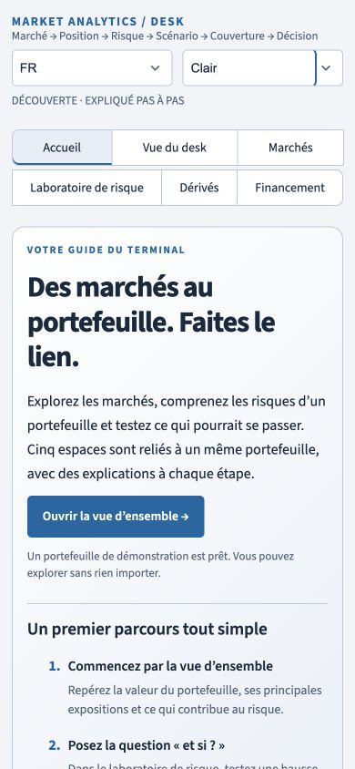

# Introductory menu — 17 September 2026

## User-facing result

The terminal now opens on Start / Accueil. A short introduction explains the shared portfolio, a three-step first visit suggests how to explore it, and five cards lead directly to Overview, Markets, Risk, Derivatives and Financing. A compact summary identifies the current portfolio, its position count, currency and source. Four FAQs explain public versus demo data, the meaning of a book, shared versus local controls, and the limits of simulations and risk metrics.

The page supports English/French and light/dark modes. The hero stacks on narrower screens; workspace cards use three, two or one column depending on available width. Card heights and button positions align within each row. Existing workspace links and old URL aliases continue to work; `?page=welcome&lang=fr&theme=dark` opens the French introduction directly.

The introduction makes no provider calls and runs no financial calculations. Entering an analytical workspace initializes the existing market context. Applied portfolio edits, language and theme survive navigation through Start. A full browser reload can still reset session state, as explained in the FAQ.

## Recovered work and checkpoint

At the resume, local HEAD and the actual remote both pointed to `3622c287f0f3b8ae9e473c5f21df5d0d954647dd`. The completed V2 and responsive-UI changes were already committed/pushed. The welcome page, copy, routing and tests were present in eight modified tracked files and three untracked files, with nothing staged. All existing changes were preserved.

The interrupted focused run had 53 passing tests. The complete run had 502 passes and one failure: an old source-text test prohibited `width="stretch"` in page files, although the pinned Streamlit 1.63.0 supports it and existing shared components already use it. The replacement test actually renders a stretching container, button, segmented control and dataframe through the installed Streamlit API. No financial test was removed. The two existing tests that expect overview metrics/controls now explicitly enter Overview, and eleven new tests cover the welcome flow.

After resuming, the remaining card alignment and heading hierarchy were completed. The full suite passed: **503 tests in 39.12 seconds**, no failures or skips. Compilation and whitespace checks passed. Implementation checkpoint `9dbcc2135dd4cfd6453f7729ce6938ba1bac517f` was committed, pushed and verified on `codex/terminal-v2` before documentation work continued.

## Validation

- Automated checks cover EN/FR × light/dark rendering; all five card destinations and return navigation; preservation of edited positions, book source, repo borrowing, language and theme; default and unknown routes; and deferred data loading followed by successful initialization from the primary start button.
- The full suite retains financial-engine, report, state, legacy-route and Python/R parity coverage. It passes 503 tests after the welcome-page changes.
- Browser checks confirmed entry to Markets through its card and return to Accueil. Dark desktop and light phone layouts were visually inspected. At widths 320, 390, 768, 1366 and 1920 pixels, the document width matched the viewport width. Card grids changed from one to two to three columns; at 1366 pixels the five cards were 423 pixels wide and 272 pixels high.
- Final screenshots were inspected and decoded. Viewport overrides were reset after testing. Testing uses desktop browser viewport emulation, not every physical device/browser combination.

## Components

`app_pages/welcome.py` renders the introduction; `core/welcome_copy.py` supplies the bilingual copy through the central translation catalog. `app.py`, `core/models.py` and `components/global_header.py` provide the default route and callbacks. `core/theme.py` contains responsive welcome styles. The existing refresh explanation now reflects deferred first-workspace loading. Tests, README and architecture/checkpoint records document the behavior.

## Captures

## Delivery boundary

The requested introductory menu is complete on the existing V2 branch. No intended implementation or validation item remains open. This branch push does not merge V2 or redeploy the hosted Streamlit site; the local preview is available separately. The existing educational/model limitations remain unchanged.
